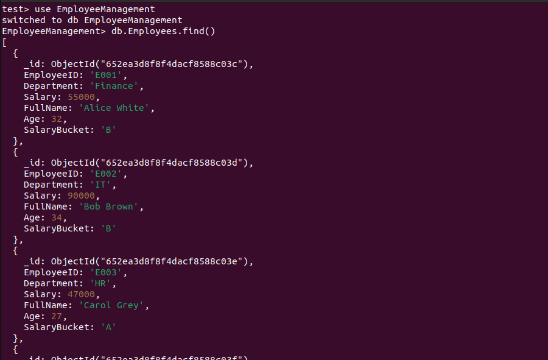

# To run
 - `git clone https://github.com/goutham794/data-engg.git`
 - `cd data-engg`
 - `mkdir app_logs` 
 We need an `app_logs` directory, this folder would be bind mount to the container, so we can view generated logs locally.
  - `docker-compose up -d`

# To view the inserted data
  - `docker exec -it my_mongo mongosh` 
 Now you get access to the mongo shell in the mongodb docker container.
  - `use EmployeeManagement`
  - `db.Employees.find()` 
 The above command displays all inserted documents in the `Employees` collection.

 

# Logs
 - Look in `app_logs/` folder to see the logs of cleaning and transformation done.
 

# Tests

## Overview

This suite of tests, located in `tests/test_main.py`, is designed to validate the data cleaning, transformation, and loading processes of our data pipeline. The suite specifically tests the read_csv, clean_data, transform_data, and load_data functions from the main module.

### Running tests locally
Setup local py env (3.8+)
 - `python -m venv env`
 - `source env/bin/activate` [FOR LINUX/MAC]
 - `.\env\Scripts\activate` [WINDOWS]
 - `pip install -r requirements.txt`
 - `pytest -v tests/test_main.py`

### Test Structure

The tests are structured as follows:

#### Reading Data:
  - test_read_csv: Checks if data is read correctly from a sample CSV and returns a DataFrame.

#### Data Cleaning:
  - test_name_cleaning .
  - test_date_cleaning

#### Data Transformation:
  - test_name_merging
  - test_age_calculation
  - test_salary_bucket_allocation

#### Data Loading:
  - test_load_data: Tests MongoDB insertion by ensuring that the  (mock) db client is called with the right data and arguments.

# Documentation

## Data Transformation and Cleaning
 - Column header names are stripped of trailing spaces
 - Stripping White Spaces in all columns.
 - Removing rows where values match the column header names.
 - Trailing and Leading non-alphabet characters are removed from the names.
 - Misaligned rows (values shifted by 1 column), due to merged first and last names, are fixed.
 - Birth date is cleaned (YYYY-MM-DD followed by random string is cleaned)
 - Period or decimal point found in Birth date is removed.

## Data Loading
The load_data function is designed to take a given DataFrame and store its records into a specified MongoDB collection.

Index is created on the <b>EmployeeID</b> field of the collection to ensure uniqueness and improve search performance.

## Assumptions
 - Trailing and Leading non-alphabet characters are removed from the names. Non-alphabet characters inside the name are kept.
 - Rows containing salaries with any non-numeric characters or negative numbers are deleted.
